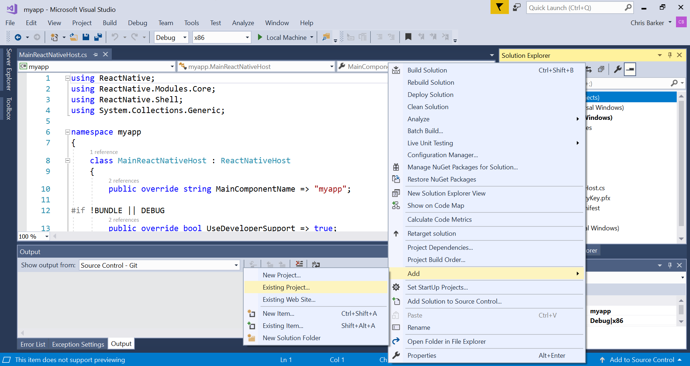
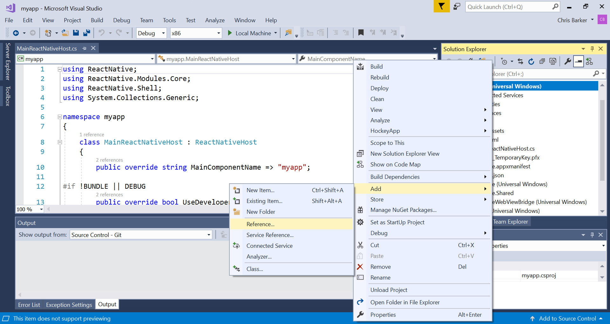
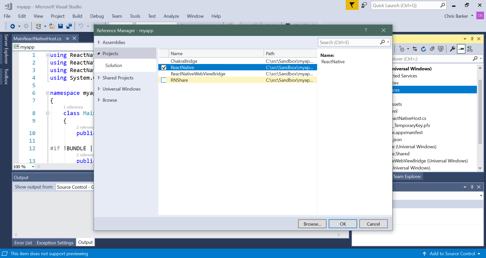
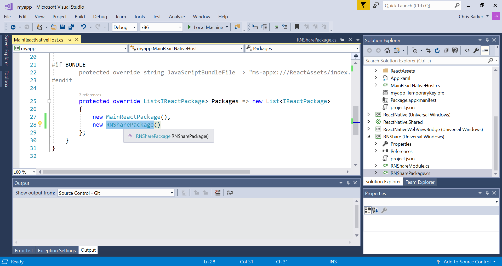

Most React Native apps will need to take additional dependencies to expose native modules and components that are not available in the core library.

## Manual Linking

### Step 1 - Add dependency project to solution

If the dependency has native code, there should be a `.csproj` file inside it's folder.

- Open your Visual Studio solution.
- Right-click the solution in the Solution Explorer
- Select Add -> Existing Project
- Choose the `.csproj` of the dependency from the Explorer window.

### Step 2 - Add a reference from the Universal Windows app project

- Right-click the Universal Windows App project in the Solution Explorer
- Select Add -> Reference
- Choose the project you just included in the solution

### Step 3 - Update MainReactNativeHost.cs

If the dependency has native code, there should be an implementation of `IReactPackage` in it's project.

- Open MainReactNativeHost.cs
- Add the `IReactPackage` implementation to the `Packages` list in MainReactNativeHost.cs

## Automatic Linking

The plan is to integrate with the [RNPM link plugin](http://github.com/RNPM/rnpm-plugin-link). For now, follow the manual instructions.
